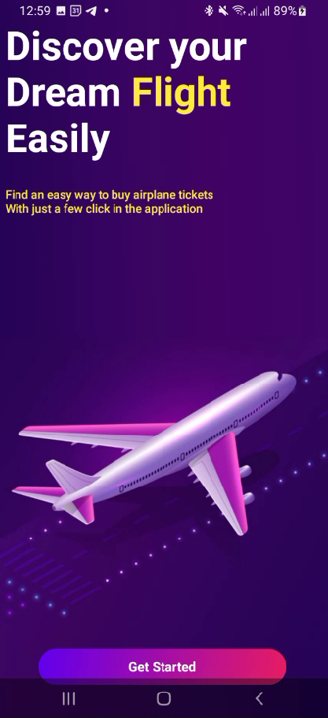

# ✈️ FlightBooking - Android App with Jetpack Compose



## 📌 About

**FlightBooking** is a modern Android flight ticket booking application built using **Jetpack Compose**. 

## 🚀 Features

- 🖌️ Modern UI with Jetpack Compose
- ✅ Clean architecture principles

## 🛠️ Technologies Used

- Kotlin
- Jetpack Compose
- Android Studio
- Material Design 3
- Navigation Component (Compose)

## 📲 Getting Started

To run the project locally:

1. Clone the repository:

```bash
git clone https://github.com/MOHAJII/Flight-booking-jetpack-compose.git
cd Flight-booking-jetpack-compose
